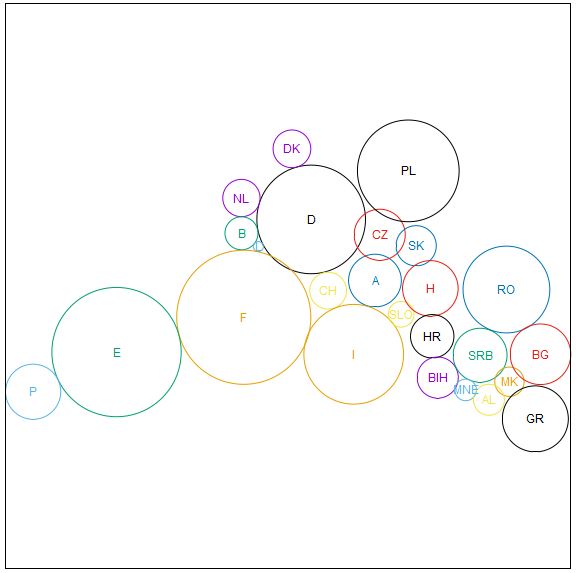

# Apprenticeship Graduation Project: Landkarten

This project was created in 4.5 days to graduate from my 3-year apprenticeship program.  
I was given the requirements and was supposed to design and implement a solution, the first day was to be exclusively used for pre-planning on paper.  
A more detailed documentation (in german) can be found [here](https://raw.githubusercontent.com/kanzomo/gp_Landkarten/main/doc/IHK_2019SS_Abgabe_KanzM_Dokumentation.pdf) and was created as part of the exam in the given 4.5 day period.

example input:
```
Fläche der Staaten
# Staat Fläche Längengrad Breitengrad
D    357 	10.0	51.3
NL	  42 	 5.3 	52.2
B	  33 	 4.8	50.7
L	   3 	 6.1 	49.8
F	 544 	 2.8	47.4 
CH	  41 	 8.2	46.9
A	  84	14.2	47.6
CZ	  79	15.3	49.8
PL	 313	18.9	52.2
DK	  43	 9.6	56.0
E 	 506 	-3.7	40.5
P 	  92	-8.2	39.6
I	 301	11.7	43.2
SLO	  20	14.7	46.1
SK	  49	19.7	48.8
H	  93	19.2 	47.1  
HR	  57	16.0	45.2 
BIH	  51 	17.8 	44.2 
SRB	  88 	20.8 	44.1 
MNE	  14 	19.2 	42.8 
MK	  26	21.7 	41.6  
AL	  29	19.9 	41.3 
RO	 228	25.0 	45.9 
BG 	 111 	25.2 	42.7
GR	 132	22.9 	39.5  			
# Nachbarschaften
D: 	NL B L F CH A CZ PL DK
NL: B
B: 	L F
L: 	F
F: 	CH E I
CH:	A I
A: 	CZ SLO I SK H 
CZ: PL SK 
PL: SK 
E: 	P 
I: 	SLO 
SLO: H HR 
SK: H
H: 	HR 
HR: BIH SRB 
BIH: SRB MNE 
SRB: MNE MK RO BG AL 
MNE: AL 
MK: AL GR BG 
AL: GR 
RO: BG
BG: GR
```

output:
```
reset
set xrange [-4.246584047232476:23.481195210528817]
set yrange [33.43197944541184:61.15975870317314]
set size ratio 1.0
set title "Fläche der Staaten, Iteration: 133"
unset xtics
unset ytics
$data << EOD
10.745528968800942 50.560729541363386 2.665012070418412 D 0
7.322107767818392 51.61093212608011 0.9140915989289315 NL 1
7.325951986303831 49.88108446058423 0.8102556018035718 B 2
8.150609246628754 49.230268433859266 0.24430125595145996 L 3
7.436587137471991 45.76053403757592 3.2897623212397704 F 4
11.576093444406224 47.06671602071096 0.9031439992304459 CH 5
13.874814279004445 47.56144489938429 1.2927207364566027 A 6
14.106216217714385 49.80732802687534 1.2536566766991937 CZ 7
15.508839896377085 52.94250537998723 2.495383166664071 PL 8
9.800000681424438 54.02506950189408 0.9249096275414899 DK 9
1.1952931764880583 44.051874360855706 3.1727827140480924 E 10
-2.893704952280974 42.105891854745636 1.3528790949515024 P 11
12.83249869270236 43.94565818038251 2.447080859684159 I 12
15.159518508586126 45.90661817668641 0.6307831305050401 SLO 13
15.89630585242033 49.268755857965914 0.9873317712085735 SK 14
16.591746584855834 47.1773769384965 1.3602118266811545 H 15
16.683235166349 44.82883589596442 1.0648844864724787 HR 16
16.952368008185207 42.80121592987835 1.0072798827589244 BIH 17
19.032004945155872 43.8974924946509 1.3231418571003069 SRB 18
18.321899274357996 42.19501889320843 0.527751030705594 MNE 19
20.47042035719878 42.597465568523276 0.719203423968949 MK 20
19.46428783711918 41.71213046177068 0.7595634724683124 AL 21
20.324110440173754 47.12236201131337 2.1297689729449574 RO 22
21.995168684722483 43.94459577790642 1.4860265258063357 BG 23
21.742246927523972 40.77436080554082 1.6205112036071436 GR 24
EOD
plot \
'$data' using 1:2:3:5 with circles lc var notitle, \
'$data' using 1:2:4:5 with labels font "arial, 9" tc variable notitle
```

Visualized output:



*note: the visualization was outside the scope of the project and can be done with gnuplot*
